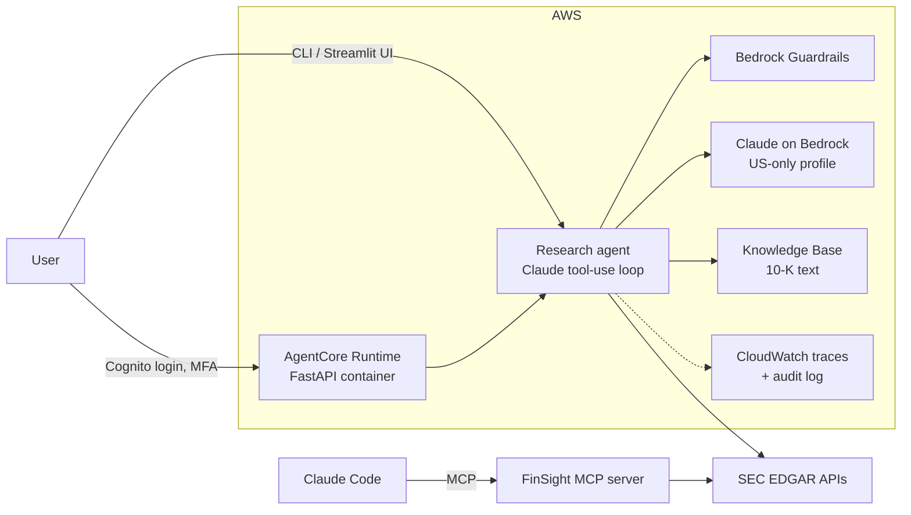

# FinSight

[](https://github.com/AkhilKadarla/Agentic_AI/actions/workflows/ci.yml)

An AI research analyst agent for the finance industry. Ask it *"Is Costco converting its
earnings into free cash flow?"* and it pulls reported figures from SEC filings, reads the
company's 10-K, shows its calculations, and writes a structured research note with charts.
Built step by step to learn agentic AI engineering the way a financial firm would run it.

## Highlights

- **Agent:** Claude tool-use loop in Python with streaming, conversation memory and
  structured outputs (Pydantic research notes)
- **RAG:** Amazon Bedrock Knowledge Base (S3 Vectors) over 10-K Risk Factors and MD&A,
  filtered by company and section
- **Guardrails:** Amazon Bedrock Guardrails check every question, and every answer paragraph
  is checked for grounding in the fetched data; fails closed
- **Evals:** 25-case number-accuracy suite (programmatic grading + LLM judge), 50/50 passing
- **Observability:** OpenTelemetry traces (local and CloudWatch) and an audit log of every
  model call
- **Deployment:** FastAPI + Docker on **Amazon Bedrock AgentCore Runtime**, Cognito login with
  MFA, least-privilege IAM as code, keyless GitHub Actions deploys (OIDC) with approval
- **MCP:** the SEC tools also run as an MCP server for Claude Code and other MCP clients
- **Quality:** 260+ tests (no network), lint and container checks in CI on every pull request



## Roadmap

- [x] **Phase 0 - Foundation:** uv, Python 3.12, project layout, secrets handling
- [x] **Phase 1 - Code quality:** ruff, pytest, pre-commit hooks
- [x] **Phase 2 - CI/CD:** GitHub Actions, branch protection, Dependabot
- [x] **Phase 3 - First agent:** raw LLM call → tool use → agent loop
- [x] **Phase 4 - Agent upgrades:** streaming + conversation memory, structured research notes
- [x] **Phase 5 - Interactive UI:** Streamlit chat app with live tool calls and charts
- [x] **Phase 6 - AWS Bedrock:** Claude on Bedrock, Guardrails, Knowledge Base (RAG) over 10-K text
- [x] **Phase 7 - Evals & observability:** number-accuracy eval, OpenTelemetry tracing, Bedrock invocation logging
- [x] **Phase 8 - Deploy:** FastAPI + Docker on Bedrock AgentCore Runtime, Cognito login (MFA),
  keyless CI/CD via OIDC with approval, CloudWatch traces
- [x] **Phase 9 - MCP server:** the SEC tools for any MCP-compatible agent (e.g. Claude Code)

## Quickstart

Requires [uv](https://docs.astral.sh/uv/).

```bash
uv sync                  # create .venv and install dependencies
cp .env.example .env     # then fill in your keys
uv run finsight ask "What is EBITDA?"   # ask Claude a finance question
uv run finsight research "Compare Apple and Microsoft revenue growth"   # agent + live SEC data
uv run finsight note "Assess Costco's financial health"   # research + save a structured note
uv run finsight chat     # interactive chat; /note saves a note from the conversation
uv run finsight ui       # web app at http://localhost:8501
uv run pre-commit install   # one-time: enable git commit hooks
```

## Running on Amazon Bedrock

FinSight runs on the Anthropic API by default. To use Claude on Amazon Bedrock instead:

```bash
aws configure sso                      # one-time: create the "finsight" SSO profile
aws sso login --profile finsight       # each day: short-lived credentials, no keys
```

Then set in `.env`:

```bash
FINSIGHT_PROVIDER=bedrock
AWS_PROFILE=finsight
AWS_REGION=us-east-1
FINSIGHT_BEDROCK_MODEL=us.anthropic.claude-sonnet-4-6   # "us." = US-only processing
```

Everything else (chat, notes, UI) works the same. Differences are isolated in
`src/finsight/providers.py`.

## Compliance guardrail (Amazon Bedrock Guardrails)

An optional guardrail checks every question before Claude sees it and every answer after
it streams, with either provider (it needs an AWS login):

- **Blocks** personalized investment advice, insider information, personal data
  (SSNs, card and bank account numbers), prompt attacks and harmful content
- **Flags** answer paragraphs not directly supported by the fetched SEC data
  (unverifiable calculations, or claims from the model's memory) for human review
- **Fails closed**: if the guardrail can't be reached, FinSight won't answer

```bash
FINSIGHT_GUARDRAIL_ID=<your guardrail id>
FINSIGHT_GUARDRAIL_VERSION=4          # pin a published version, never DRAFT in real use
```

Before publishing a new guardrail version, run the regression suite against the draft:
`uv run python scripts/guardrail_suite.py DRAFT`

## 10-K text search (Amazon Bedrock Knowledge Base)

FinSight can index the narrative sections of 10-Ks (Risk Factors, MD&A) into a Bedrock
Knowledge Base backed by S3 Vectors, so answers can cite what companies actually wrote.

```bash
uv run finsight index TSLA AAPL      # download, extract sections, upload, sync
uv run finsight index --list         # what's indexed
```

With a Knowledge Base configured, the agent gets a `search_filings` tool and answers
"why" questions by quoting the filing; the guardrail grounds those quotes too.

Settings: `FINSIGHT_KB_ID`, `FINSIGHT_KB_DATA_SOURCE_ID`, `FINSIGHT_FILINGS_BUCKET`.
The IAM policy the developer role needs is in `infra/iam/`.

## Evals

`evals/number_accuracy/` measures whether FinSight gets financial figures right: 25
reviewed questions with answers from SEC data (single facts, multi-year, calculations,
comparisons, and "unavailable" traps), graded automatically (numbers) and by a Claude
Haiku judge (traps).

```bash
uv run python -m evals.number_accuracy.run_eval --approve-harness   # after reviewing changes
uv run python -m evals.number_accuracy.run_eval --reps 2            # ~$0.60, ~3 min
uv run python -m evals.number_accuracy.run_eval --report
```

Baseline (Sonnet 4.6 on Bedrock): **50/50 correct, 50/50 from fetched data**. Results and
transcripts: `.claude/hillclimb/number_accuracy/baseline/`.

## Observability

Every question is recorded as an OpenTelemetry trace: a span per guardrail check, model
call and tool call, with timing, tokens and cost (GenAI semantic conventions). Traces are
written to `logs/traces/<date>.jsonl` (git-ignored, deleted after 30 days).

```bash
uv run finsight traces              # recent questions: time, cost, tools, outcome
uv run finsight traces 719df4fc     # one question, step by step
```

Independently, AWS records every Bedrock model call (who, when, model, tokens, request and
response) in CloudWatch Logs: `/finsight/bedrock-invocations`, 30-day retention. See `infra/iam/`.

## Web API (AgentCore Runtime contract)

`src/finsight/api.py` serves FinSight over HTTP: `GET /ping`, `GET /info`, and
`POST /invocations` (`{"prompt": ..., "action": "chat" | "note" | "reset"}`), streaming
agent events as server-sent events. Sessions are keyed by the
`X-Amzn-Bedrock-AgentCore-Runtime-Session-Id` header.

```bash
uv run uvicorn finsight.api:app --host 127.0.0.1 --port 8080   # local only (no auth)
```

The `Dockerfile` builds the linux/arm64 image AgentCore requires (no UI libraries, no
secrets, non-root user); CI builds and health-checks it on every pull request.

## Deployment (Amazon Bedrock AgentCore Runtime)

After CI passes on `main`, `.github/workflows/deploy.yml` waits for approval in the
`production` environment, logs in to AWS with OIDC (no stored keys), pushes the image to ECR
(immutable tags) and creates or updates the AgentCore runtime (`deploy/agentcore.py`).

- **Login required:** AgentCore accepts only Cognito access tokens from FinSight's app client
  (invite-only user pool, MFA required); the deploy role can't create a runtime without it
- **Least privilege:** the app's role can only read (Claude via the US-only profile, the
  guardrail, the Knowledge Base); IAM policies live in `infra/` as code
- **Traces** go to CloudWatch without question/answer text; the Bedrock invocation log is the
  audited record of content

Use the deployed agent from the terminal or the web UI (logs in with PKCE in your browser):

```bash
uv run finsight remote                            # chat with the deployed agent
FINSIGHT_UI_BACKEND=deployed uv run finsight ui   # web UI with login
```

## MCP server

FinSight's SEC tools (`get_company_filings`, `get_financial_facts`, `search_filings`), a
metrics resource and a research prompt are available to any MCP client. In this repo,
`.mcp.json` registers the server for Claude Code automatically; just ask, e.g. *"Using
finsight, how has Apple's revenue changed over 3 years?"*

```bash
uv run finsight mcp      # the stdio server that MCP clients start
```

## Development checks

```bash
uv run ruff check .          # lint (find bugs & style issues)
uv run ruff format .         # auto-format code
uv run pytest                # run tests with coverage
uv run pre-commit run --all-files   # run every commit hook
```

## Project layout

```
src/finsight/   # application code
  cli.py        # command-line interface
  agent.py      # research agent: loop, memory, streaming events
  providers.py  # Anthropic API vs Amazon Bedrock (client + request settings)
  guardrail.py  # Bedrock Guardrails: input/output checks, grounding per paragraph
  filings.py    # extract Risk Factors / MD&A text from 10-K HTML
  knowledge_base.py  # Bedrock Knowledge Base: upload with labels, sync, search
  tracing.py    # OpenTelemetry spans, local JSONL exporter, retention, trace viewer
  llm.py        # simplest single Claude call (ask)
  notes.py      # ResearchNote schema (Pydantic), Markdown rendering, saving
  ui.py         # Streamlit web app (renders the agent's events)
  api.py        # FastAPI web API (AgentCore Runtime contract, SSE streaming)
  remote.py     # PKCE login + client for the deployed agent
  mcp_server.py # the SEC tools as an MCP server
  charts.py     # Altair charts for research notes
  tools.py      # tool definitions Claude can call
  sec.py        # SEC EDGAR API client
  config.py     # settings loaded from .env
tests/          # automated tests (no network, no API calls)
evals/          # number-accuracy eval suite
deploy/         # AgentCore create-or-update script (run by GitHub Actions)
scripts/        # manual live checks (e.g. guardrail regression suite)
infra/          # infrastructure as code (IAM policies, Cognito, ECR)
```

## License

[MIT](LICENSE)

> Disclaimer: FinSight is a learning project and does not provide financial advice.
